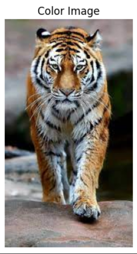

# Histogram and Histogram Equalization of an image
## Aim
To obtain a histogram for finding the frequency of pixels in an Image with pixel values ranging from 0 to 255. Also write the code using OpenCV to perform histogram equalization.

## Software Required:
Anaconda - Python 3.7

## Algorithm:
### Step1:
Import cv2, matplotlib.py libraries and display the saved images using cv2.imshow(). 

### Step2:
Use cv2.calcHist(images, channels, mask, histSize, ranges[, hist[, accumulate]]) to find the histogram of the image. 

### Step3:
Plot the image and its stem plots using the plt.show() and plt.stem() functions. 

### Step4:


Equalize the grayscale image using the in-built function cv2.equalizeHist().

### Step5:
Print the original and equalized image using cv2.imshow() and end the program. 

## Program:
```python
# Developed By: YUVARAJ.S
# Register Number:22008589
import cv2
import matplotlib.pyplot as plt
gray_img=cv2.imread("img2.jpg",0)
color_img=cv2.imread("img1.jpg",-1)
gray_img=cv2.cvtColor(gray_img,cv2.COLOR_BGR2RGB)
color_img=cv2.cvtColor(color_img,cv2.COLOR_BGR2RGB)
plt.title("Color Image")
plt.axis("off")
plt.imshow(color_img)
plt.show()
plt.title("Gray Scale Image")
plt.axis("off")
plt.imshow(gray_img)
plt.show()
```

# Write your code to find the histogram of gray scale image and color image channels.
```python

# Developed By: YUVARAJ.S
# Register Number:22008589

hist=cv2.calcHist([gray_img],[0],None,[256],[0,256])
plt.figure()
plt.title("Histogram")
plt.xlabel("grayscale value")
plt.ylabel("pixel count")
plt.stem(hist)
plt.show()

```
# Display the histogram of gray scale image and any one channel histogram from color image

```python

# Developed By: YUVARAJ.S
# Register Number:22008589
hist=cv2.calcHist([color_img],[0],None,[256],[0,256])
plt.title("Histogram of Color Image:Red Channel")
plt.xlabel("Intensity value")
plt.ylabel("pixel count")
plt.stem(hist)
plt.show()
```


# Write the code to perform histogram equalization of the image. 

```python
# Developed By: YUVARAJ.S
# Register Number:22008589
equ=cv2.equalizeHist(cv2.imread('img2.jpg',0))
equ=cv2.cvtColor(equ,cv2.COLOR_BGR2RGB)
plt.title("Equalised Image")
plt.axis("off")
plt.imshow(equ)
plt.show()
```
## Output:
### Input Grayscale Image and Color Image
 
### Histogram of Grayscale Image and any channel of Color Image


### Histogram Equalization of Grayscale Image


## Result: 
Thus the histogram for finding the frequency of pixels in an image with pixel values ranging from 0 to 255 is obtained. Also,histogram equalization is done for the gray scale image using OpenCV.
